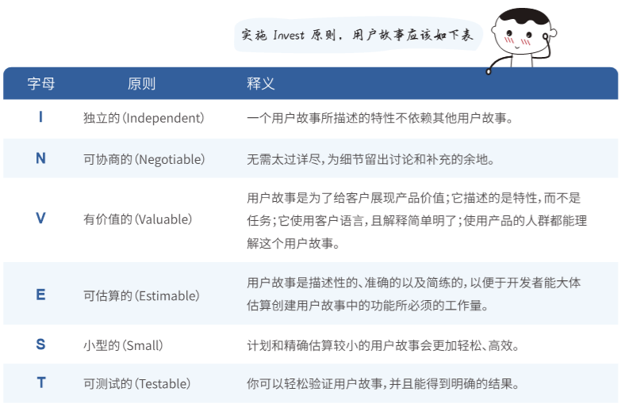
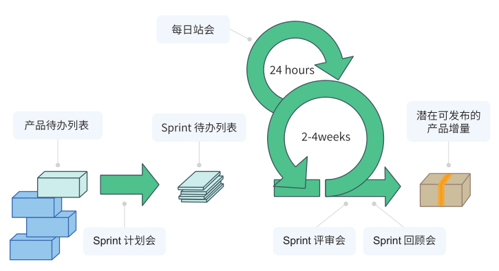
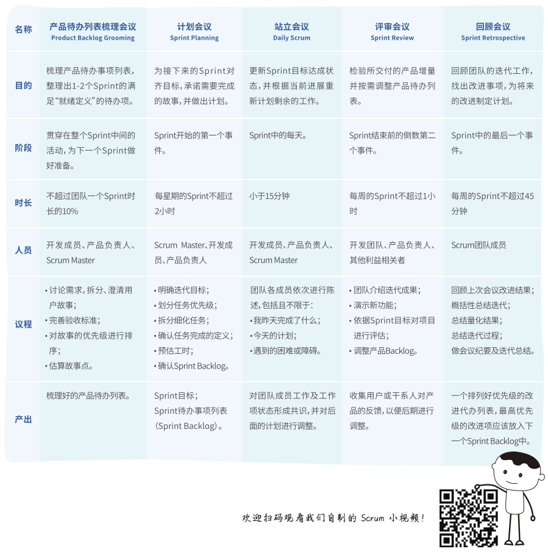
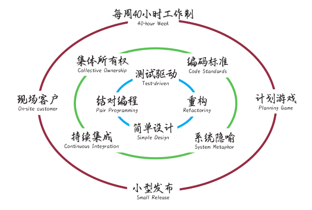
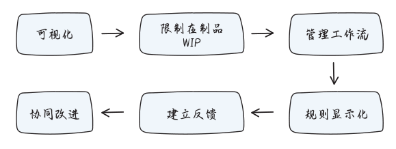
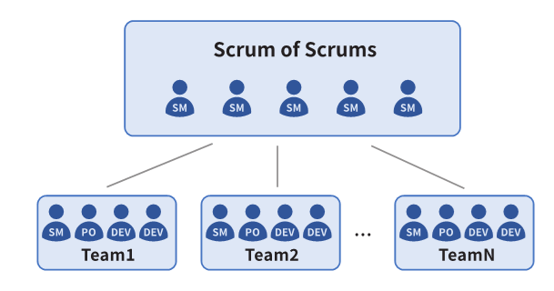
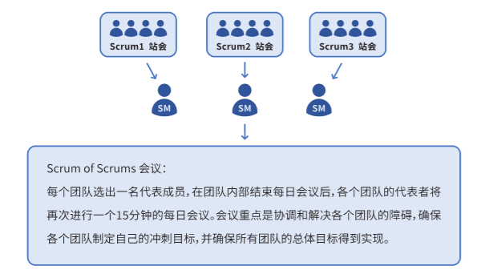
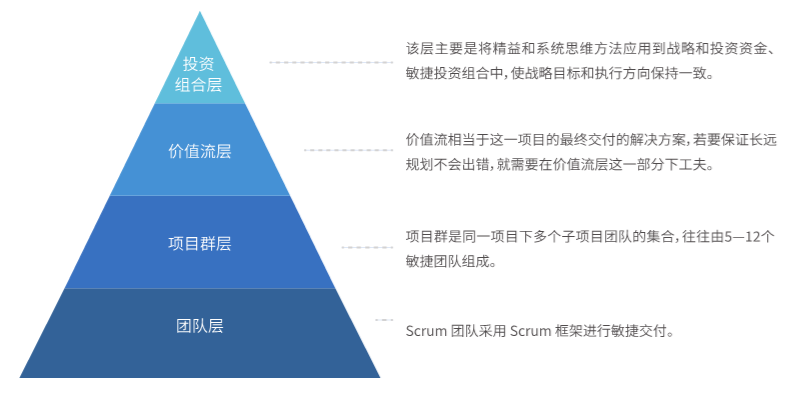

# 2.1 敏捷开发

目前，以敏捷为基础的软件开发方法论已形成一个庞大的体系，主要是以一种更加简洁、可持续、短周期、高效率的方式进行软件开发。其中包括 Scrum、XP（极限编程）、Kanban（看板）、规模化敏捷等。接下来，阿道会向大家依次介绍。

## 2.1.1 用户故事与 Invest 原则

在介绍诸多敏捷方法之前，我们需要先了解一个重要概念⸺用户故事。用户故事是敏捷方法的重要基石，早在1996年，极限编程就提出了 “故事”（Story）的概念，这是用户故事的起源。无论是 Scrum 还是看板 ，甚至是规模化敏捷 SAFe 等，在需求领域，最终都会落在用户故事上。

这里和大家分享比尔韦克（Bill Wake）的 Invest 原则，它可以帮助我们提高用户故事的质量。

## 2.1.2 Scrum

在敏捷开发的方法论体系中，Scrum 高居敏捷方法论的首位，也是团队转型敏捷的首选。但 Scrum 究竟是如何解决软件开发过程中的沟通、协作问题的？

敏捷作为一种软件开发运动，其发起人试图以一种更为敏捷的新方式来思考软件开发方法论以及组织架构， 从而帮助行业中的人们更好地进行软件开发。而其中稳居 C 位的 Scrum 方法论，关注每一Sprint结束后的成果交付，促使每一团队在现有框架的基础上，能够根据自己团队的实际情况制定合适的Sprint任务，提高工作效率、扩大反馈。

在以Scrum为核心的软件开发过程中，以下五个会议能够帮助团队高效沟通、及时改进，也是需要团队格外注意的。让我们一起来看看会议流程：

## 2.1.3 极限编程

Scrum 和 XP 没有高下之分，若将两者结合，那一定能发挥出更大的力量。前人对 XP 方法论总结出了什么样的实践呢，跟着阿道一起来看一看吧。

## 2.1.4 看板

在团队转型敏捷的道路上，有很多阻碍转型的因素。而在这一过程中，看板能够通过其简单、高效、灵活、改善工作流程等优势，帮助团队排除重重阻碍。

我们在设计看板的时候，要注意几个小贴士：

### 可视化原则

工作状态可视化：以等待、处理中、已完成三个元素呈现工作状态；

任务项可视化：成员任务处于团队的迭代周期中，任务、时间、工作量透明且直观；

工作流程可视化：通过任务状态的变换完成工作交接，拉动价值从左向右进行流动。

### 流动原则

看板系统强调端到端的价值流动，我们以一个产品开发过程为例制作看板，看板的任务项要包括：开发、测试、待发布、发布、已发布，其中开发又可以划分为实现、评审、完成。

这样从用户需求开始，最终以价值交付为结束的开发过程，实现了价值的流动，并且价值最终又流回用户手中。

### 拉动原则

看板通过看板传递指令，由后面的流程拉动前面流程的生产，实现清晰、有序的生产管理，最终拉动价值流动，追求团队、用户双方满意的产品质量。

### 协作原则

看板要求限制 WIP（在制品），在团队协作的过程中，如果同时需要拉动多个价值的流动，会导致每个人的精力过于分散。在对任务划分优先级的时候，团队需要有这个意识——集中力量解决优先级较高的任务，保证需要快速解决的事情被优先处理。

## 2.1.5 规模化敏捷

在软件开发行业中，一般情况下，敏捷团队通常为5—12人，但在大型企业中，开发团队往往会有几十乃至上百人，这时候要怎样敏捷起来呢？

### Scrum of Scrums

Jeff Sutherland 在《规模化敏捷： 五家公司的Scrum创新实践》一文中对此作出了回答，他首次提出了 Scrum of Scrums 这一规模化敏捷方法。

Scrum of Scrums 主要集成同一项目中多个 Scrum 团队的工作，通过召开 Scrum of Scrums （以下简称 “SoS” ） 会议消除障碍，确保提高各个团队输出的协调性。

SoS会议流程如下：

### SAFe

说到百人团队，就要涉及管理层面的概念，如何在保持敏捷的状态下去管理这上百人的团队，成了管理者亟需解决的问题。而 SAFe 就是以敏捷为基础，糅合管理知识而成的规模化敏捷框架。

